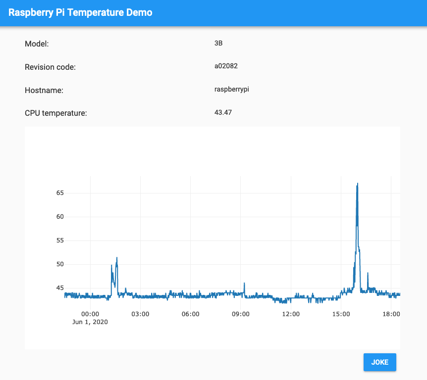

# Anvil Raspberry Pi Temperature Demo

This is an [Anvil](https://anvil.works/) app demo designed for deployment to a
Raspberry Pi.



Built in a video tutorial at https://www.youtube.com/watch?v=2B7tWrW5XkA

## Anvil mock version

The app started as a hosted Anvil app, with mock functions. You can clone this
version of the app here: https://anvil.works/build#clone:VSPXKHLKL3BPYLKX=K3C6MJV6OXLKMSP7LQUWYNAB

Then I added the Pi functionality and pushed the changes to this git repo.

## Requirements

Tools used (`*` = essential):

- git `*`
- vim
- byobu
- ranger

```bash
apt install vim git byobu ranger
```

Anvil requirements:

- Python 3
- pip
- JDK 8

```bash
apt install python3-pip openjdk-8-jdk
```

Raspberry Pi specific requirements:

- gpiozero
- RPi.GPIO
- pyjokes

```bash
pip3 install gpiozero rpi.gpio pyjokes
```
